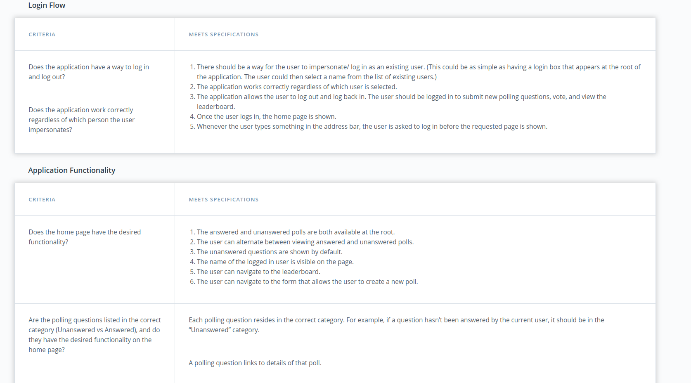

# Udacity Would You Rather Project

- **AIM**: web app that lets a user play the “Would You Rather?”
- Functionality:
  - A user is asked a question in the form: “Would you rather [option A] or [option B] ?”.
  - Answering "neither" or "both" is against the rules
  - In your app, users will be able to answer questions, see which questions they haven’t answered, see how other people have voted, post questions, and see the ranking of users on the leaderboard.
  - check rubric rules

## Peek a boo!


## Deployed using Zeit now (now Vercel)

[visit](https://udacity-would-you-rather-project.now.sh/login)

# Installation and App Launcing

```
$ yarn or npm i
$ yarn start or npm start
```

# Rubric Rules





# Backend Data

### DATA.js

The `_DATA.js` file represents a fake database and methods that let you access the data. The only thing you need to edit in the `_DATA.js` file is the value of `avatarURL`. Each user should have an avatar, so you’ll need to add the path to each user’s avatar.

- There are two types of objects stored in our database:
  - Users
  - Questions

### Users

Users include:
| Attribute | Type | Description |
| --------- | ------ | -------------------------------------------------------------------------------------------------------------------------------------------------------------------------------------------------------------- |
| id | String | The user’s unique identifier |
| name | String | The user’s first name and last name |
| avatarURL | String | The path to the image file |
| questions | Array | A list of ids of the polling questions this user created |
| answers | Object | The object's keys are the ids of each question this user answered. The value of each key is the answer the user selected. It can be either `'optionOne'` or `'optionTwo'` since each question has two options. |

### Questions

Questions include:
| Attribute | Type | Description |
| --------- | ------ | -------------------------------------- |
| id | String | The question’s unique identifier |
| author | String | The author’s unique identifier |
| timestamp | String | The time when the question was created |
| optionOne | Object | The first voting option |
| optionTwo | Object | The second voting option |

### Voting Options

Voting options are attached to questions. They include:
| Attribute | Type | Description |
| --------- | ------ | ------------------------------------------------------------------ |
| votes | Array | A list that contains the id of each user who voted for that option |
| text | String | The text of the option |

Your code will talk to the database via 4 methods:

- `_getUsers()`
- `_getQuestions()`
- `_saveQuestion(question)`
- `_saveQuestionAnswer(object)`

1. `_getUsers()` Method

_Description_: Get all of the existing users from the database.  
_Return Value_: Object where the key is the user’s id and the value is the user object.

2. `_getQuestions()` Method

_Description_: Get all of the existing questions from the database.  
_Return Value_: Object where the key is the question’s id and the value is the question object.

3. `_saveQuestion(question)` Method

_Description_: Save the polling question in the database.  
_Parameters_: Object that includes the following properties: `author`, `optionOneText`, and `optionTwoText`. More details about these properties:

| Attribute     | Type   | Description                                |
| ------------- | ------ | ------------------------------------------ |
| author        | String | The id of the user who posted the question |
| optionOneText | String | The text of the first option               |
| optionTwoText | String | The text of the second option              |

_Return Value_: An object that has the following properties: `id`, `author`, `optionOne`, `optionTwo`, `timestamp`. More details about these properties:

| Attribute | Type   | Description                                                                                                                  |
| --------- | ------ | ---------------------------------------------------------------------------------------------------------------------------- |
| id        | String | The id of the question that was posted                                                                                       |
| author    | String | The id of the user who posted the question                                                                                   |
| optionOne | Object | The object has a text property and a votes property, which stores an array of the ids of the users who voted for that option |
| optionTwo | Object | The object has a text property and a votes property, which stores an array of the ids of the users who voted for that option |
| timestamp | String | The time when the question was created                                                                                       |

4. `_saveQuestionAnswer(object)` Method

_Description_: Save the answer to a particular polling question in the database.
_Parameters_: Object that contains the following properties: `authedUser`, `qid`, and `answer`. More details about these properties:

| Attribute  | Type   | Description                                                                             |
| ---------- | ------ | --------------------------------------------------------------------------------------- |
| authedUser | String | The id of the user who answered the question                                            |
| qid        | String | The id of the question that was answered                                                |
| answer     | String | The option the user selected. The value should be either `"optionOne"` or `"optionTwo"` |

## More...

This project was bootstrapped with [Create React App](https://github.com/facebook/create-react-app).

## Available Scripts

In the project directory, you can run:

### `yarn start`

Runs the app in the development mode.<br />
Open [http://localhost:3000](http://localhost:3000) to view it in the browser.

The page will reload if you make edits.<br />
You will also see any lint errors in the console.

### `yarn test`

Launches the test runner in the interactive watch mode.<br />
See the section about [running tests](https://facebook.github.io/create-react-app/docs/running-tests) for more information.

### `yarn build`

Builds the app for production to the `build` folder.<br />
It correctly bundles React in production mode and optimizes the build for the best performance.

The build is minified and the filenames include the hashes.<br />
Your app is ready to be deployed!

See the section about [deployment](https://facebook.github.io/create-react-app/docs/deployment) for more information.

### `yarn eject`

**Note: this is a one-way operation. Once you `eject`, you can’t go back!**

If you aren’t satisfied with the build tool and configuration choices, you can `eject` at any time. This command will remove the single build dependency from your project.

Instead, it will copy all the configuration files and the transitive dependencies (webpack, Babel, ESLint, etc) right into your project so you have full control over them. All of the commands except `eject` will still work, but they will point to the copied scripts so you can tweak them. At this point you’re on your own.

You don’t have to ever use `eject`. The curated feature set is suitable for small and middle deployments, and you shouldn’t feel obligated to use this feature. However we understand that this tool wouldn’t be useful if you couldn’t customize it when you are ready for it.

## Learn More

You can learn more in the [Create React App documentation](https://facebook.github.io/create-react-app/docs/getting-started).

To learn React, check out the [React documentation](https://reactjs.org/).

### Code Splitting

This section has moved here: https://facebook.github.io/create-react-app/docs/code-splitting

### Analyzing the Bundle Size

This section has moved here: https://facebook.github.io/create-react-app/docs/analyzing-the-bundle-size

### Making a Progressive Web App

This section has moved here: https://facebook.github.io/create-react-app/docs/making-a-progressive-web-app

### Advanced Configuration

This section has moved here: https://facebook.github.io/create-react-app/docs/advanced-configuration

### Deployment

This section has moved here: https://facebook.github.io/create-react-app/docs/deployment

### `yarn build` fails to minify

This section has moved here: https://facebook.github.io/create-react-app/docs/troubleshooting#npm-run-build-fails-to-minify
